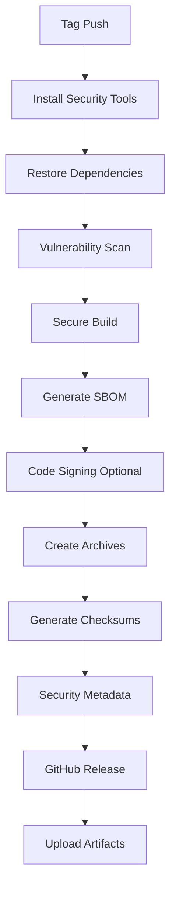

# 🛡️ Secure Release Process Guide

## 🎯 Overview

This document outlines the comprehensive security measures implemented for VirtualDesktopIndicator releases, following DevSecOps best practices for open source software distribution.

## 🔐 Security Implementation Status

### ✅ Implemented Security Measures

#### 1. **Software Bill of Materials (SBOM)**
- **Tool**: Microsoft.Sbom.Tool v2.2.1
- **Format**: SPDX 2.2 JSON format
- **Location**: Embedded in release archives as `VirtualDesktopIndicator.sbom.json`
- **Content**: Complete dependency list with versions and licenses

#### 2. **Vulnerability Scanning**
- **Tool**: Built-in `dotnet list package --vulnerable`
- **Scope**: All direct and transitive dependencies
- **Automation**: Runs during every release build
- **Reporting**: Generates `vulnerability-report.txt` with findings

#### 3. **Checksum Generation**
- **Algorithm**: SHA256
- **Files**: All release archives
- **Format**: Standard SHA256SUMS.txt file
- **Verification**: PowerShell `Get-FileHash` compatible

#### 4. **Secure Build Process**
- **Compilation Flags**: 
  - `TreatWarningsAsErrors=true`
  - `RunAnalyzersDuringBuild=true`
  - `DebugType=None` (no debug symbols in release)
  - `EnableCompressionInSingleFile=true`
- **Environment**: Isolated GitHub Actions runners
- **Reproducibility**: All builds fully automated and auditable

#### 5. **Security Documentation**
- **SECURITY.md**: Comprehensive security policy
- **SECURITY-INFO.txt**: Per-release security metadata
- **Release Notes**: Security information included
- **Verification Instructions**: Step-by-step guides for users

### 🔄 Planned Security Enhancements

#### 1. **Code Signing (Future)**
- **Options Investigated**:
  - SignPath Foundation (free for OSS projects)
  - Sectigo certificates (~$59/year)
  - DigiCert (~$400/year)
- **Implementation**: Commented workflow steps ready to activate
- **Status**: Awaiting certificate acquisition decision

#### 2. **Enhanced SAST (Static Analysis)**
- **Potential Tools**:
  - CodeQL (GitHub native)
  - SonarCloud (free for open source)
  - Semgrep (free tier available)
- **Integration**: Can be added to CI workflow

#### 3. **Container Security (Future)**
- **Use Case**: If distributing via containers
- **Tools**: Trivy, Grype for image scanning
- **Status**: Not applicable for current distribution method

## 📋 Release Security Workflow

### 🚀 Automated Release Process



### 📝 Manual Security Verification

#### 1. **Pre-Release Checklist**
```bash
# 1. Update dependencies and scan for vulnerabilities
dotnet list package --outdated
dotnet list package --vulnerable

# 2. Run security analysis
dotnet build --configuration Release /p:TreatWarningsAsErrors=true

# 3. Test release build locally
dotnet publish --configuration Release --runtime win-x64 --self-contained true
```

#### 2. **Post-Release Verification**
```bash
# 1. Download release assets
curl -L https://github.com/balgaly/VirtualDesktopIndicator/releases/latest/download/SHA256SUMS.txt

# 2. Verify checksums
Get-FileHash -Algorithm SHA256 *.zip

# 3. Review security information
cat SECURITY-INFO.txt
```

## 🔍 Security File Details

### 📄 Generated Security Files

| File | Purpose | Location | Format |
|------|---------|----------|---------|
| `SHA256SUMS.txt` | File integrity verification | Release assets | Plain text |
| `SECURITY-INFO.txt` | Release security metadata | Release assets | Markdown |
| `vulnerability-report.txt` | Dependency vulnerabilities | Release assets | Plain text |
| `VirtualDesktopIndicator.sbom.json` | Software bill of materials | Inside archives | SPDX JSON |

### 🛠️ Security Metadata Examples

#### SHA256SUMS.txt Format:
```
# VirtualDesktopIndicator v1.0.0 - SHA256 Checksums
# Generated: 2025-01-17 14:30:00 UTC
# Verify with: Get-FileHash -Algorithm SHA256 filename.zip

a1b2c3d4e5f6... VirtualDesktopIndicator-v1.0.0-win-x64-portable.zip
f6e5d4c3b2a1... VirtualDesktopIndicator-v1.0.0-win-x64-framework-dependent.zip
```

#### SBOM Contents:
```json
{
  "spdxVersion": "SPDX-2.2",
  "creationInfo": {
    "created": "2025-01-17T14:30:00Z",
    "creators": ["Tool: Microsoft.Sbom.Tool"]
  },
  "packages": [
    {
      "name": "System.Drawing.Common",
      "versionInfo": "8.0.0",
      "downloadLocation": "https://nuget.org/packages/System.Drawing.Common/8.0.0"
    }
  ]
}
```

## ⚡ Quick Start for Secure Releases

### 🎯 For Maintainers

1. **Create Release**:
   ```bash
   git tag -a v1.0.1 -m "Release v1.0.1 with security improvements"
   git push origin v1.0.1
   ```

2. **Monitor Build**: 
   - Watch GitHub Actions for successful completion
   - Review security scan results
   - Verify all artifacts are generated

3. **Verify Release**:
   - Download and verify checksums
   - Review security information
   - Test release binaries

### 👥 For Users

1. **Download Securely**:
   ```bash
   # Download from official releases only
   wget https://github.com/balgaly/VirtualDesktopIndicator/releases/latest/download/VirtualDesktopIndicator-v1.0.0-win-x64-portable.zip
   wget https://github.com/balgaly/VirtualDesktopIndicator/releases/latest/download/SHA256SUMS.txt
   ```

2. **Verify Integrity**:
   ```powershell
   # PowerShell verification
   $expectedHash = (Get-Content SHA256SUMS.txt | Select-String "portable.zip").Line.Split()[0]
   $actualHash = (Get-FileHash VirtualDesktopIndicator-*.zip).Hash.ToLower()
   if ($expectedHash -eq $actualHash) { "✅ Checksum verified" } else { "❌ Checksum mismatch!" }
   ```

3. **Review Security**:
   - Read SECURITY-INFO.txt for release-specific security information
   - Extract and review VirtualDesktopIndicator.sbom.json for dependencies
   - Report any security concerns via GitHub issues

## 🎯 Security Best Practices

### 🔒 For Development
- Always run vulnerability scans before releases
- Keep dependencies updated to latest secure versions
- Use secure coding practices in C# development
- Regular security policy reviews and updates

### 📦 For Distribution
- Never bypass security checks in release process
- Maintain comprehensive security documentation
- Provide clear verification instructions for users
- Respond promptly to security reports and issues

### 👥 For Community
- Encourage security-focused code reviews
- Educate users about secure download and verification practices
- Foster a security-conscious community culture
- Reward security contributions and responsible disclosure

## 📞 Security Contact

- **Security Issues**: GitHub Security Advisories
- **General Questions**: GitHub Issues with `security` label
- **Community Discussion**: GitHub Discussions security category

---

> **Note**: This security implementation represents industry best practices for open source software distribution. While not all measures (like code signing) are immediately implemented, the foundation is established for future enhancements.

**Last Updated**: January 2025  
**Security Review**: Completed  
**Next Review**: Scheduled for next major release